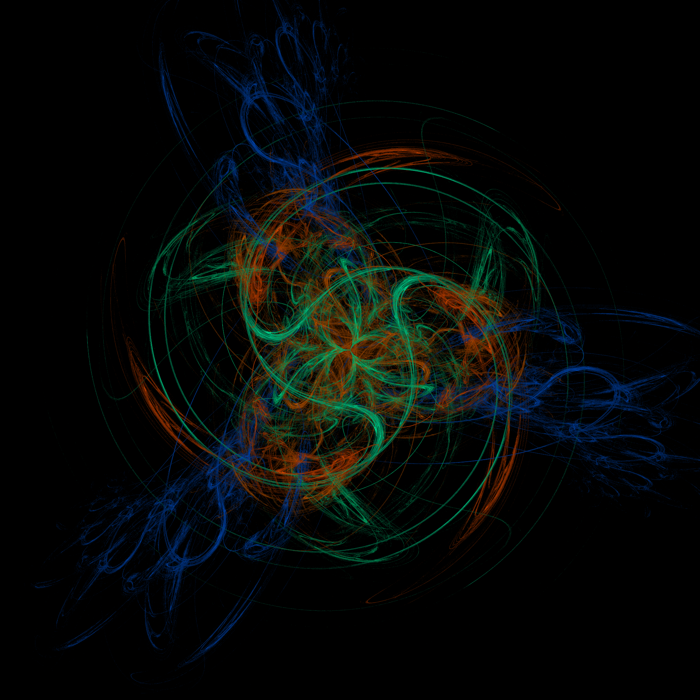

# README

## Генератор фрактального пламени

**Генератор фрактального пламени** — мощный инструмент для создания детализированных изображений фрактального пламени. Он использует параллельный рендеринг для значительного увеличения производительности и позволяет тонко настраивать свойства изображения с помощью множества параметров.

## Сборка приложения

Приложение собирается в `fat JAR` с названием `fractal-flame-generator.jar` с использованием плагина `maven-shade-plugin`.

1. Убедитесь, что у вас установлен Maven.
2. В корневом каталоге проекта выполните команду:

   ```bash
   mvn clean package
   ```

3. После завершения сборки `fractal-flame-generator.jar` будет находиться в каталоге `target/`.


## Обзор параметров

### Входные параметры

Поддерживаются следующие параметры командной строки:

- **`--file`**: Путь к выходному изображению (обязательный параметр).
    - **Пример**: `--file fractal.png`

- **`--samples`**: Количество выборок на пиксель (обязательный параметр).
    - **Пример**: `--samples 1000`

- **`--iterations`**: Количество итераций на выборку (обязательный параметр).
    - **Пример**: `--iterations 10000`

- **`--symmetry`**: Уровень симметрии фрактала (по умолчанию: 1).
    - **Пример**: `--symmetry 3`

- **`--variation`**: Указывает вариации, применяемые к фракталу. Можно использовать несколько вариаций.
    - Поддерживаемые вариации: `LINEAR`, `DIAMOND`, `HEART`, `POLAR`, `SPHERICAL`, `SWIRL`
    - **Пример**: `--variation linear --variation swirl --variation heart`

- **`--gamma`**: Значение гамма-коррекции для регулировки яркости (по умолчанию: 1.0).
    - **Пример**: `--gamma 1`

### Пример команды

```bash
java -jar fractal-flame-generator.jar --file fractal.png --samples 1000 --iterations 10000 --symmetry 3 --variation linear --variation swirl --variation heart --variation linear --gamma 1
```

Эта команда создаст изображение со следующими параметрами:
- **Имя файла**: `fractal.png`
- **Сэмплов**: 1000
- **Итераций на сэмпл**: 10000
- **Симметрия**: 3
- **Вариации**: Linear (x2), Swirl, Heart
- **Гамма**: 1



## Сравнение производительности: Параллельный рендеринг против последовательного

Параллельный рендеринг значительно повышает производительность генерации изображений по сравнению с последовательным способом. Ниже приведены примеры времени выполнения:

| Размер изображения | Выборки | Итерации | Симметрия | Время (последовательно) | Время (параллельно) | Ускорение (примерное) |
|--------------------|---------|-----------|-----------|-------------------------|---------------------|-----------------------|
| 800x800            | 1000    | 500       | 2         | 289 мс                  | 75 мс               | 3.85x                 |
| 1000x1000          | 2000    | 1000      | 3         | 1057 мс                 | 240 мс              | 4.40x                 |
| 1000x1000          | 2000    | 10000     | 1         | 4645 мс                 | 1270 мс             | 3.66x                 |
| 1000x1000          | 10000   | 10000     | 1         | 15666 мс                | 5069 мс             | 3.09x                 |
| 1500x1500          | 10000   | 10000     | 1         | 25893 мс                | 6855 мс             | 3.77x                 |
| 1000x1000          | 100000  | 100       | 1         | 3054 мс                 | 789 мс              | 3.86x                 |
| 1000x1000          | 1000000 | 100       | 1         | 19483 мс                | 6788 мс             | 2.87x                 |

Как показано в таблице, параллельный рендеринг может быть до **4.40 раз быстрее** для некоторых конфигураций и обеспечивает значительное увеличение производительности даже для более сложных изображений.

## Конфигурация системы

- **Процессор**: Intel Core i5-1135G7 (4 ядра, 8 потоков)
- **Оперативная память**: 16 ГБ
